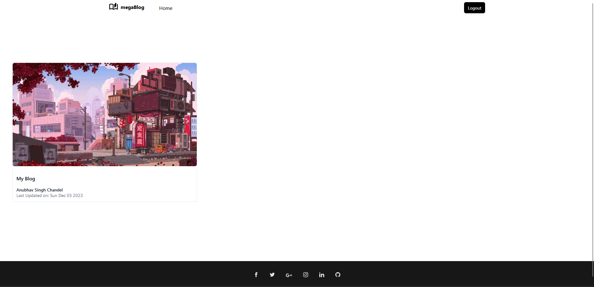
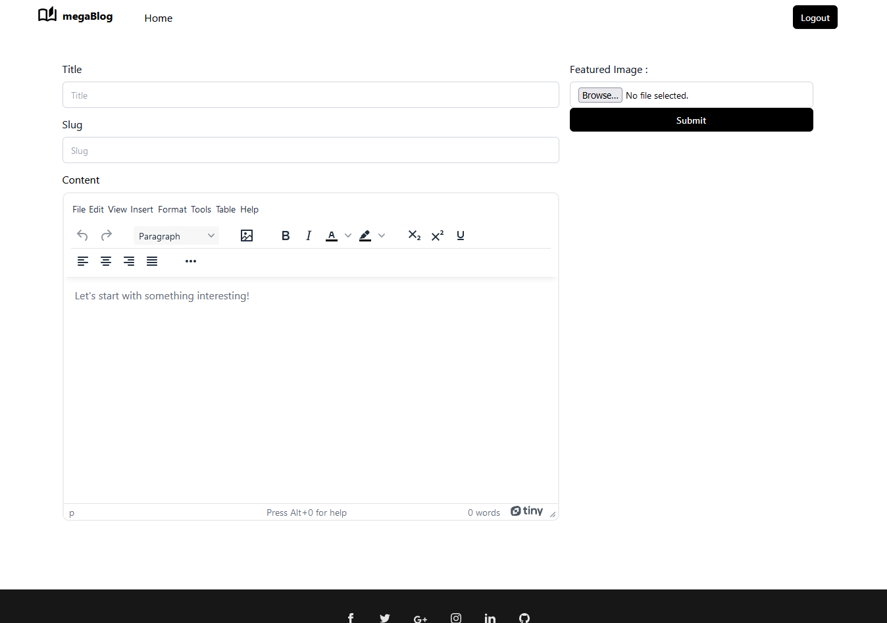
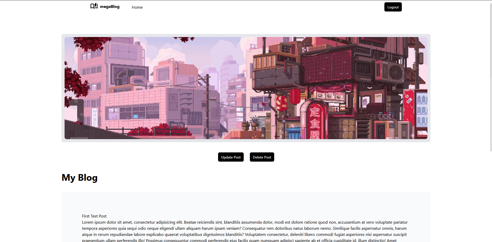
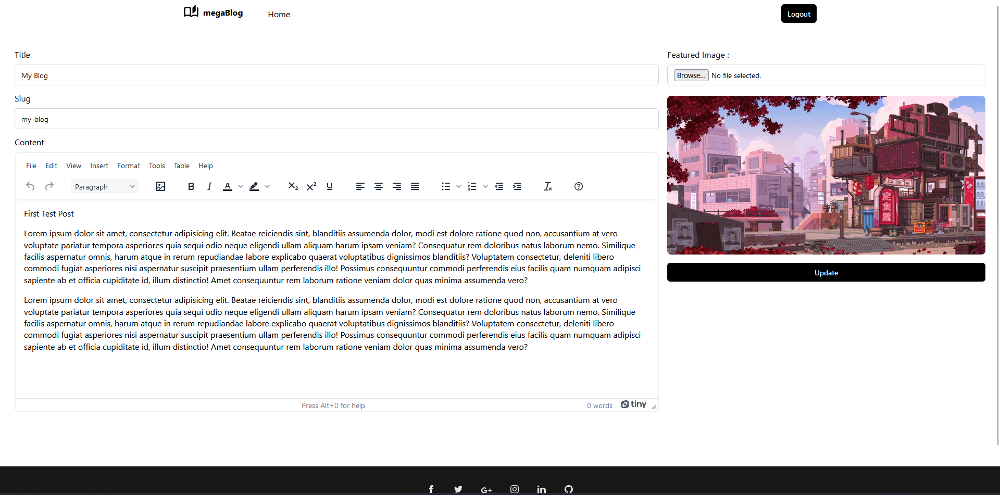

Readme.md file for a blog creating and posting website made with react and appwrite as backend

## How to run the project

1. Clone this repository and also <a href="https://github.com/AnubhavSinghChandel/megaBlog-Backend.git"> the backend</a>
2. Run `npm install` on both the respos
3. Run `npm run dev` on each folder for backend and frontend (Both will start on a different localhost port).
4. Go to specified `localhost` to see the project running

## Features

### View all blog posts

### Create a new blog post

Click on the `Create New` button on the Home screen to create a new blog post

### View Edit and Delete a blog post

- Click on the `Update Post` button on the Post page to edit a blog post.
- Click on the `Delete Post` button on the Post page to delete a blog post

#### View Post

#### Update Post

